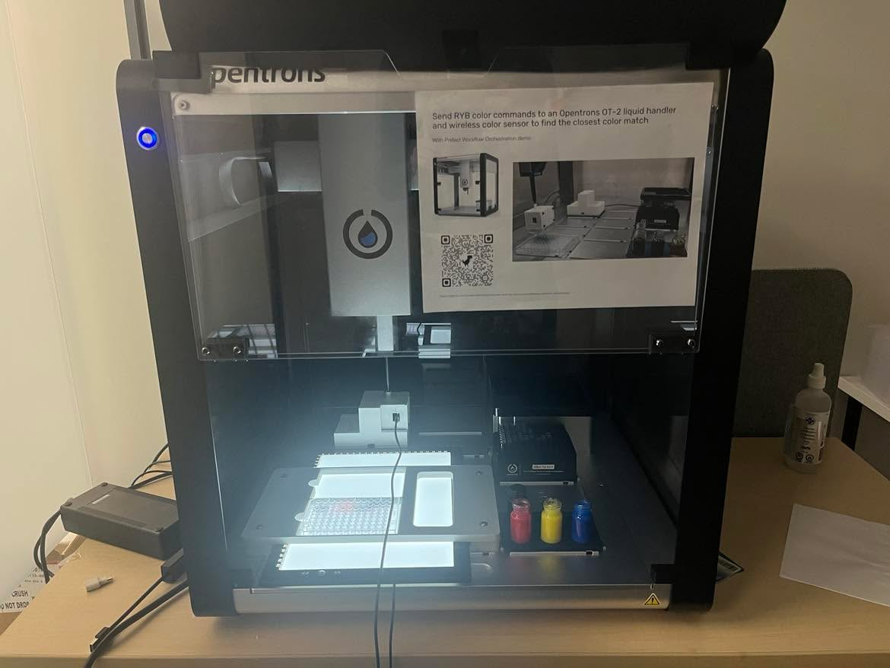
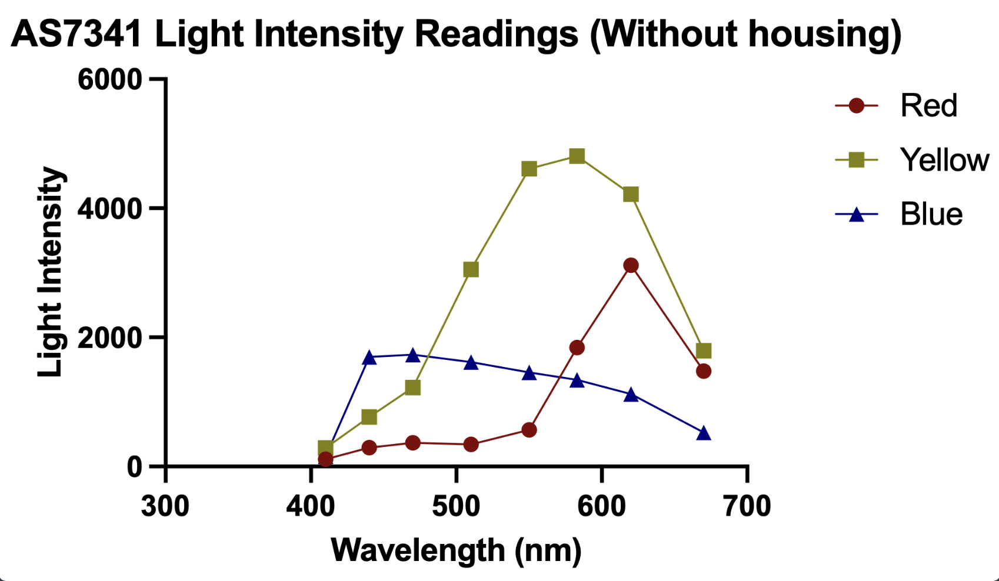
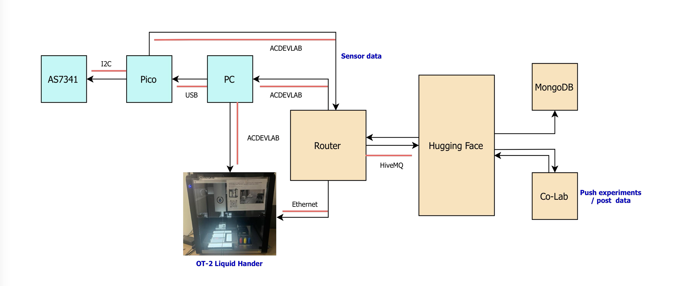

# OT-2-Color-mixing-Demo

## Project Overview

Automated colour-mixing platform
using an OT-2 Liquid Handler to prepare dye solutions and measure their respective light intensities. This project is to be used as an educational tool for self-driving labs (SDLs) in collaboration with the Acceleration Consortium.

The platform's components are:
- Opentrons OT-2 Liquid Handler to prepare 300 μl (food) dye solutions
- Red, Yellow, and Blue stock solutions (reservoirs), waste bottle + 3D-printed bottle holder
- Adafruit AS7341 sensor + Raspbery Pi Pico for spectral measurements
- Router for signal transmissions
- Hugging Face API for single experiment submissions
- Google Colab for batch submissions 
- Laptop
- MongoDB database (student ID's and experiment results can be found here)
- 96-well plate
- 96 300 μl tiprack
- 3d printed sensor housing + base
- Cable for LAN connection between the OT-2 and router

## Getting Started

**Note:** If this is your first time accessing the OT-2 via SSH, you will need to connect the robot to the laptop and use the wired IP for connecting. You can access this information through the Opentrons OT-2 desktop app.

1. Place the components in their respective locations (see the figure below as reference)
2. Power on the OT-2 and connect it to the router via LAN
3. SSH into the OT-2 using the wireless IP and run 'OT2mqtt_Aug_18.py' in 'var/lib/jupyter/notebooks'
4. Connect the Raspberry Pi Pico to the laptop via cable and run 'main.py' on the microcontroller (**Important:** if the sensor times out on connection the first time, reconnect the cable and run the program again)
5. Access the repository for the Hugging Face [client](https://accelerationconsortium-ot-2-lcm.hf.space/) and restart the space

## Data

**Note:** student_id's not found in MongoDB or experiments requesting >= 300 μl will not be submitted to the OT-2 for execution.

The platform measures the light intensity of a respective sample with examples shown below:

## Color matching

A colour matching example using Bayesian Optimization (using the Honegumi pattern) is demonstrated below. The corresponding Colab can be found [here](https://colab.research.google.com/drive/1-E5FCywyZ9ZaMQF9BYOz4gHCYF9lMWDV?usp=sharing). 

## Notes

**Killswitch:** the Hugging Face queue can be cleared and frozen using the 'student_id' = 'pause', and reopened using the 'student_id' = 'resume'. When the queue is frozen, the current experiment will complete and all batch submissions will be terminated. Likewise, the queue will also be killed if the robot is out of pipette tips or wells.

**Reservoir Preparation:** fill the three reservoir bottles with tap water and add 1 drop of food dye (Red, Yellow, or Blue) to each bottle.

**Colab operations:** do not close the Colab notebook when running batch operations to avoid incomplete experiments.

**Operation Diagram:** the figure below outlines data flow in the system. On the chance the sensor times out during an experiment, restart the platform (this includes reconnecting the sensor to the PC).

## Acknowledgements

Thank you to Professor Jason Hattrick-Simpers (Supervisor), Professor Gurpaul Kochhar (SDL Hackthons), Dr. Ashley Dale (SDL Hackathons), Rafael Espinosa Castañeda (SDL Hackathons), Quentin Currier-Moritsugu (Mentor), Ang Li (Mentor), Dr. Sterling Baird (Documentation), and Kelvin Chow (Documentation) for their contributions to the project this summer.
